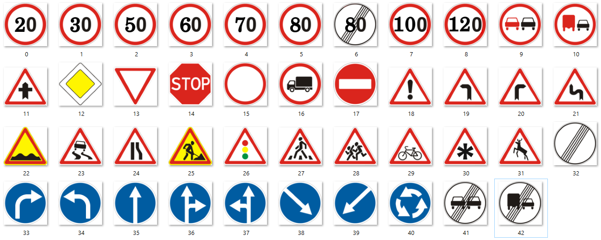

# Traffic Sign Detenction and Recognition with YOLOv8

<img src="data:image/jpeg;base64,/9j/4AAQSkZJRgABAQAAAQABAAD/2wCEAAkGBxISEhUPEBAQFRUVFhcXFRYVFRUVFRcVFhoYFxcXGBYYHSggGBolGxgXIjEhJSktMC4uGB8zODMtNygtLi0BCgoKDg0OGxAQGi0lICYtLS0tLS0tLS8tLS0tLS0tLS0tLS0tLS0tLS0tLS0tLS0tLS0tLS0tLS0tLS0tLS0tLf/AABEIANEA8QMBIgACEQEDEQH/xAAcAAABBQEBAQAAAAAAAAAAAAAAAQIDBAUGBwj/xABLEAABAwEFBAUIBgcGBQUAAAABAAIRAwQFEiExBkFRcSJhgZGxBxMycqGywfAUIzNCUtEVYnOCkqLCJDVTdOHxNENjw9IWJVST0//EABsBAAIDAQEBAAAAAAAAAAAAAAAEAQMFAgYH/8QAPREAAQIDBAcHAgQDCQAAAAAAAQACAwQREiExQQUTUWFxgZEiMjOxwdHwoeEjQlJyBhXxFDVDgpOistLi/9oADAMBAAIRAxEAPwDAaJPNSYej3KNgzVym3IjdIPituK6yQsuCy00/Pl/mq72/DwUMKw85dw7hHxUUZLuGeyq4oqfqmQiE6EisVKSEQlSoQmJYToQhCYhOQhCahOSoQmIT1PY7DUqyKTcURObRE6ekQuIkVkNpfEcABiSQAOJNEKtCIWiy5K7sxTnMj06erTBHpaggp42ftH+F/PT/APJKnSkiMY8P/UZ/2RVZcJFoMuesXmkGHENek2N09KYJEiQNJE6rYpbO2bzWN9rhwjEQzoDEYbGKC8E5BwyO6VDtKSbcYzOTmnyOeW1dtYXbOZouYhELpbRsbWHoPpvHMsP82XtWXa7jtNMS+hUjWWjG0cyyQDzTDJiE+llwNd6kwnjEfOSzUJzmEGCCDwOqIVyrTUQnQkhCEiISwiEISIhOQhCbCRPQhCUKxReY6ufemtbBBT6P3h1f7JWOQ4DiPNOwGlvNMfpzzQ5uXf8ABPaOPzlmkI6M/O5RDdlvUxGm87vJQAIhThmRUBCZa6tUq9tAEQhLCF0q0kIhLCEISQhLCIQhJCISoQhJCuWJ7WsfjBIJYBESDD88+qfjIyVRTMHQd6zPCoqJmG2JDLHYEit5H5hmL1NaLUde1OZDKg6Rfqyc6nncjGXS1I1EDdKsbP3jBZSp0C98RDW02icNNuUDoj6sE8e4LEsNjfWeKdJuJx0HxPALuWts92UC97pecnOHpOduZTHxWHM6H0bBZQw+Vt/17SZgQIkc2R/XcPm9F7Np2UG0Va5AEkMAa7pvw4mtP3icB5Yj2cTV2hszg4Op18yILamDCGh4aBB3B7stM8gFjX/fVW1VMbzAGTWA5AcAN54nfygLKWAZOAD+GCODjlz238V7eV/huWaz8cEuOxxAG64379+Fy6d+0zvOPfTr2loc57g2Q5rcTsUQXEexX7Nt3UZGJ2PrdTAPexwHsXEoTDAWABpNOK1ToyWcKFu7ovRTt3ZqmVezuI4kU3ex2nenNtN01spdRJ5t8Q5gXm6OSYhzMWHg49UnG0BJxMiOdfMFd7e9zMohtVj3PpP9F7cJGeYBIOcjMHmsuKfGp3N/NWtjL6aQbBac6dTJhP3XH7s7pOY4HmmXrd7qFQ03Z72nc5p0Pzvlb8hMa9tHE2hvXidKaOdJxS3LIqCKfGp3N/NEU+NTub+aihKtAQxXE9VmJa1MAwJiGnPXpAO+KZCltIzHqs9xqjhEIksaTsHkoSISwhdoU1QQPnrQw6njl3QSnV4j50+Som+Px+fYs5zhS18uWq0X2U9+nbknkSBHyclBW1PaU9j/ABlcMJbQ/MF08Agg7gpXDo93goCp3OBEc+4aKGE7ANW1SEwKOokQlhEK9UJEJYRCEJEJYRCEJEJUqEJqtWKzOqDzbAJc9gEmBo/Uquuk2JH1jzwA8SFRMvLIRcMqeYXcNltwac1tONnuugXOMvOTnD0nu/Az28u8ny6/r5qWqpjeeiMmgei1vAcTxO/uXS+VcHz9P1DlunG6fh3Lhl5aZjOe8glfRtCyMKHBbGAvI6DYPU4lNSoSpVbaRIlSKUJEIQhQnNcvRLntovCz+YqEfSKIljj99vHtyB64PUvOVbu+2vo1G1aboLTIPwPEEZEK2BGMJ4cEjpGSZNwSx2OR+ZHNb1SmWktcCCCQQdQRqE2F0V4tZa6AttEQ4CK7N4IGbuwRnvEHcufheul47YzA9q+YTEB8CIYbxeE607vVZ7jVGpbQMx6rPcao4XUHw28B5BUpEJYQrEUUj95UNNxkQfn/AGlTBuRz1/0VYNkE5ZHPrgwstx7Jb8xotYC8ORUOpU78o65HJQHIdxPbMqSk7Oefgh7aupsQ00FdqnB+KYQnaJITsLC75ikY153/ANEiIToRCvql02EJ0IhFUJqE5EIqhNhEJ0IhQhNhdLsR6b/VHiucXQ7GfaP9UfFKzngu5f8AIK2B4jVS8rg+vp8ne8fzXC0qRcQ1oLicgAJJPAAaruvK0PrqfKp7yz/JsG/SXTqKbi3nibMdcT7V5d7bUWi+kycfU6OEWlaA3f5ismvsza2NxOs743w3Ee5pJCxyNxC9Zv7aCpZqoBszn0YB84MRzOucQCOBieK5O/r2slS1U6tOnDWlpqksBDhILgW7yBIJ39cBREhsbgeqmTnZiKAYkO4gkFpBF2RvNDsFx3G+nIpF6vZrFdlqkU2USYkhgNMgSBMCN5Cz762MszKVStSdUBptLoxNc2WAugyJ3cVJgOpUEFct0zBtWIjXNO8fD1AXnCRdDc2yle0jG0NYzcXEgGNYgEnnEJl9bLWiyjG9ocz8TTjaOGLIFvaFXYdS1S5P/wBqgazVWxa2V+dMVgpVLToudOFrshJgEwOPJMwngVymBetnZa/HWWqHZmm6A9vFvEdY3d29dLft3NYW1qJBo1RiYRoJzw8uHduXABd/cxm6Xz92tl1Zs/8AI960tGR3MjBmRXl/4lkoboOvHeF3G4+yzbRqPVZ7jVEp7QMx6jPcaooXooXht4DyXg01CdCFYhFLdO/VVwIBEZk+yTM96Wo7IgcPDNMO4bzr2gSsaKRrCMrvMey2mVsDb9k4T2uI7gc/nrSiRlmd+SRknPOIiNMhv6lJE5QrwbQcdvkqSLJA2XqRgOp11SpwPJFNiZhOuolozKmpSIhOIRCYSqSEkJ0JYUqExKlhEIQmwiEsJYUVQkW9sf8AaO5fByw4W5sh9qeX9L0vOeC7l5hWwPEbxVXytj6ylzqeLVyFwU65rs+i4/OAyIjLcSZyw55zxXYeVwdOif2v/bXLbN366y1MYALXABzT+EaSeI4ry0WmtvX0mQLzo9oYATQ0BwN5x3ee4VI7O79tBi8xa6LmPGTi0dEHQ4mHNvtWb5Qbhp04tVINaCcL26MxQXBwG7Qg9nWt6lf1318NSoaIe2PtWNDmnqcRB7CsHbvaOlVYLPRdjGLE94Bw5AgNE66zKteQWG04HZtWdKNe2bZqoTmfrBrZpz9yoPJj/wAQ/wDZO95iy9sHlttrwXDpDSN4Bj2rR8mp/tD+um73mrN22yt1Y/rM9rGKk+COK0oX95v/AGDzC7+/rebFY2eaGYwU2yJAyOZHJp7VmbIbTOtRdZrQGOJaSCWgBzd7XN0OR9hU950zbruaaXSeA10De5rS1zeebo7OK53YG7av0oPLHhtMPxEtIgkFobnvz06lcXO1jaYGiyoMvBMnF1gGsaTxBFKZ+61NnLB9HvKrQbOEMcWTrhdhcBO+NOxbdtvOxOrmx1qbS8kN6bGkEuAIAdqDnG7NU/Oj9LQN1HCecF3hCuWzZ+zVLT9IdUPnGuY7CHU9QBEiMQEAb10AQCG0xOKpjvhviNiR7QrDaajG1kTu9aBef7Y3KLLXhsljhLZ3AkggneZHdC6HZsTddYcKn/4qh5RrxZVqsZTcHebacTgZGInpCd8ADvV/ZDO77QODp/lb+SJWjZkWdqc0i6I/RAdF711frQ8xQqhaBmPVZ7jVHCmtAzHqs9xqjhenheG3gPJfP02EJYQu6oVGsYIB58Nf9ipKZnMQdQO8DwVao+SM92nYc+zNWqImm0aamN2pj2ALFpbiAcPVbZNllVJEDLhGaWg0jXf8/kr9nuzE0OdXYBAcei8xo0CQMOPTIZ59alfdDQINopiHRpVknSAIziCDGmcpuG1wFohZkXSEtaLbeFx7LscDlks2OWgVilwVsXUwSTaaAh2Ak4gMYnIEjMyD3IfYWtgeepnFhgBr8w402SDEGPOMnhIXTWkNIXB0lKlwJf1DvbeOqpnRNha1nuc1AC2qwyMXou7RIGGZy71DSuwlxYHtEecLTDjiFFwp1IAzycWjrTMMmyKpOLpCVtGj8Nx9QN6z4SQp2tZE+cZ6WeYIAhjtZguio3oa+lwTXsgkcCR3ZLoOBwVjIrH1smtOKihEKSE0hSu02EJ0IhCE1bOzNUMqS4gAmJOQ9GpvPJZMJ4HQd6zfB6pmG24Zbtp5hdsdZcCtXyr2cubTqNEtDnS4ZgYw0tPI4TmvNgvTdnbc17TYLR0mPBFOevWmT7WnccuEcRtJcjrLWdTdJac2H8TfzGh/1XmJmE5rqlfQ9BzjHwxBzFSN4Jr1FVlT1pJQkSq31ZsdrqUnY6T3NOktJBjhI3JtstT6rzUqElzolx1MAAewBQIRVc2W1tUv2rb2d2jq2QkN6THasdvPV+HmuntXlEGH6ugccZYnBzQeQHS9i89SKxkV7RQFJx9HS0Z9t7KnmK8aYrpNmb3DLaLRaah6eLE4gnNwI0aOMckbb2xlW0mpSqBzS1uY0kCCFzqFzbNmyrRKtEcRwbw2zTKiUru9hjNjtbe3+R35Lgl3Xk9zo2tv6g9raiulDSM1KaaFZJ/LzCgtAzHqs91qjhTVxn+6z3WpkL1kLuN4BfLhgo0KSELtSsOq0F5diAgNbv4u/NWKjyGgAHTvnwUAOKctSZ5gkDlpKsVnE4cIMQJMbgIPgsUH8QUzr86LaNzTXKi06N5GkGgMp+hTMEvzIwvDnNa/CX5DpRoAFddVtDwcNmxY9Q1loykyQIfk06lo9IqV9vNlZS8wA2tVpMe+qQ1zg0ktaxkghohknn1LNtO0Nsf6VqrfuvLd36sLShSkaIwEEAZV9gPVYTzJNebUOrsSd+d9Vsfoq11QQ6wNcHQem2oBlIEB9To+m7IcVObrrz5yoyxU8vRqVXBozY7JjapaM6bDIH3VyVotL3np1Hu9Zxdv61W+fYU0JB+b/wDb6k+ioL5XKD1PDKm4DgADgF31iotpiBabCwNB6FIVnsYwAEkMDsLe7jnmov0hYWOLvpJccpwU64zmX4cVWGhzhLg3XKZWh5O7nDaTrTUaCaoLWgj/AJcif4j7GhcXtNdJstodSzwzipniwkx2jMHkqYLIb4zoNs9nDAV25HD3VkaVhNhCLqW9rHHlW/P7Ld/Tl3tGEUrS/pYzicW4nR98+cJeMh0XbgqVW/rLJLLDOZPSrPPDcGrmfn2I+fBPtk4Y2nmfSiWa8N7jQ3gF0P8A6ocD0LJYm86OMxPElbFrs1GtZG26nTFN2LBUYD0Q7FEtBMAdXWuGHz3ru7q/uh37b4sVE3CZDa1zBQ2gORqmZd7nlwcSbq47CFzsJYToRCqVybCkb6DvWb4PTYT2joO9Zvg9cRO7zHmEKu9k/Aro2hl5WZ1CqQK9MSHb50FQdR0cOR3hc/CfQrPpvbWpmHt04EbweIIyKWnJfWNtDHPePsnpKZdCeKGmw7D7LkbbZH0nupVGlpBgjr/JVoXqG0N207dRFtoNHnGjC5pzPRGJzCPvOAzbxB6xHntekMMgARmIbh4SCORBBXmYkMtK+jyU82Zhh1KHAjYfY5KihKkVafSpqcmqUJUqalChCc1ej7FXU6hZq1escIqMOFp1ww6HHmXZD81l7D7NCp/arQAKTc2h2j40J/VHtPVK1L8vU1nYWyKbTkOJ/EfhwWjo+UdEeHHBeW0/pVrGmXZft5GtOtKnkM1m19f3We61MhS1xn+6z3WqJeihdxvALwiIQlQu0LEo0JaS6IjGMtZzxHjuMLQaIB0nPmY+QmtaIwjTJoPHMDu/JMc6TB3RMdZ07VjQ+w/fT19ltPFtu6vp7lad/H/h/wDLUfF6yDp2f0ha+0B6VDKP7NR8XLHOnZ8AvTy3gs4LysfxXcUx3z3q5c13G0VmUGyMRzI3NAJce72wqzhn2/1L0PydXTgpG1OHSqCGTupic/3iO5oXM3MamEXZ5cftjyVspB10QNyz4ffBddTY1jQxoDWtAa0bgBAAXPbb3R9Io4mD6ykS5vW2ek32TzHNcF5abutta00m06NerQwdAU2Pe0VZOLEGgw6METu03r0jZQuFlo06lRr6lNjWVSHteQ9ozY5wJlzdDyXmIcR0N4eMQvRxIbXsLDgV5DVOQ7I/gYkdTIEyOvqXQ7XXT9HtAwjoVCXs4CGtBb2EdxC55zsxOgDfAEr1cGIIjQ5uBv8AnlxXm4kMscWuxBolDOJAPA/OS7m52n9EvG/zvxYuLDsiO8SBOZOeehyz4LtLkn9Fvn/FkxwlnDd+SWnXEw2/uHkVfKgBx4eoWDg4EHkkDeSnbM5mdCN/3mjwKa0QO/8ApS1blfRMw9Y+fanRDT6zfByVxMTOeX9X5BTeaJBDQT0hpwl64iOAFSbqjzCgi5VQzlnolwiBx138SPgFO6i+Mmv7AdwA8ZQKD4gNfoPukb3Ze0KNcz9Q6hTcpbmvA2apPpU3kB7RO77w4OEz7FW25uKItdnINN4BdGkugh0/hdlyI61N9HdI6LzzBPDPTn3K9ctvNNrrNaKVR1FwGE+ae4DFhxMIAPRPsPMrJnoUMguDhTiLitrRekXQIgNcLqbR7jEFea+a/Wb3nwie5NeyOB6xovS33Jd9SC0vYc85qtiRu842Aoq+wlF4+rrVN2bg18xPDD1LJ1eYI6heuZpyWOJI4j2qvOvNccI5zp2DJMc2DBXfVtgaonBXYZnUPZMk74O6BPUeKyLZsRaxm1tN/qncN2cKC2iZZpWUcfFbzNPOi5ddPsbs2bS/G+RRYczoXHXAD4ncD1pLr2NtD6rWVabmM1Li2QANwjIuO5dnelYUqYslnY4NaIJDXab2zvned881dKwmxXYim8hI6V0zDgQ7MJwLjmCDTpW85bMTS5Vr9vMOihRgU2wOjkDGgH6o+dyxoUvmHfgf/CUv0d/4H/wOXp4boUMBrXDqF89iRC91oplYZj1We6FFCnrtzz4N90KOF1B8NvAeQXCbCRPQrELNqzkcxJyG4QdecJ9IZzlppG/SfHuUQql0Eg5h0iDpBABKQTOvVlnoMljwwNcSd3r9ltPrqwFp7SelR/y9H+pY2Lw+AWvtH6VH/LUfByxvn2Beolb4DOAXlowpEdxK0blu91orsoCek7M8GgkuPd7YXsVGmGNDGgBrWgAbgA2AO5cp5ObqwUzanDpVDhZ1Na7M9rh3NCyNur9r2usbku0EvI/tVWYaxkZsLtwg9IjjhEkkLC0lH1kWwMG3c8/Zbej4FiHaOJ8svm9cx5SvKI+tUdZbDVc2g2WvqMMGsZzwuGYpiN3pZnSFzWxm0lou54tDGOdZ3vwVGxDHkAOIB0bUAcCPyUvlD2bp3fWo2am4uPmGue85Ynl7wSG/dbAAA4DUnNddsZd5qbPWtraRqOqPqFjA3G4vDWNaWj8QiRySFRRPru7wZSvOxCrZnB0jHSdoQ9ogsPA6tI/JeV1JznXQg5RG6F6l5Obpq2W76NCu3DU6bnN3jG5zgD1wRK5jyhXN5qt9IYOhVJnqePS7xnzxLW0VMUdqTnhxzHMX8t6y9IwKgRBlj6LlWvPV2gHf1rurgd/7VUP/AFct34OC4Jq73Z3+6qn7X4U09Pj8Nv7h6pGU754eoWNiPzHzuHcgTolhEJZMVTTw+fnXvTsR+QOfikhLCEJhTh870QiEVKhJ1pQd6IRCmpUrA2psZqebEw0Y8Wk/dyHBXGbPNaHNo1KtJjmYHtbhcXNmR0ngkQeCL7GTe34LYB4cAfisebJ1pvWrK3Qgs67rPXoTTFqqupk4gS4iqHDKMQywamI1V0W21j0bbW/fbTqD+ZsqSruUUJmVhMfDq4VNSqI8aI2JRrir1G/LVBa+rTdIgFtPA8dch0exUISwiE2xjWCjUo+I55q4piWE6EQrKlcJsIhOhEKEJIQlhCFCyy5oJ1OWZknPv0UjqeQA5nSRpMd6iFOCG7yY3DQgz8O9AqA4gJInCSBGngNcwseGe2758+Z0Wy8dkfPnzKqubS+nR/y9DwKp3Pd7rRWZQb945ng0AFx7BKu7S+nR/wAvQ8Ct3ZJtKx2WredpJa2IaYk4JDchvLnwAOrrXoNfqZNrhjQU4/bHgvPw4OtmS3K0a8Krv6FJrGtYwQ1oDWjgBkB3KrbrRRs9OraqmFjWsxVHgDEQxuUnVx3Adax702yo0aVlrGnWcbY5raLAGh/TgguBdAHSb/EFx/ll2qDGOutrDieylUfUxZBodiwYYznAM50K83ivRUXIV7vtl91bXeDWw2m0loMnJubKFPi/CZO6T+sF1/kEvCaVps0+i+nVbyeC13cWN/iV7yUX240qtg8wxn0NglwcSX1HucXYhAg4gRvXlt03/arLWN5WZjaYquqMgNJoy6Hup4Z3YmkCdw4FTuQvpnd88FRvu7W2ii+g7LEMj+FwjC7sPxXB39tXbHXNZ7ys1UMqYmCvDGEH0qbhDgYHnA3SMin7bbSV6P0C9rPUqGyPw+epD0SHjGJH4sJeMzk5rVAJa4EYhQQHChwXJV7O6m91N4hzSWuHWCQV2+zf911f2p/7aj2+uxrwy8KMFjw3GRoQ77OpyIgfwqXZn+7Kv7U+FNb8xHEaWa8fqFdxoahYkKEYUw5h2XcKiix4RCeiFWuqJkIhOhLCEUTIRCdCIQiibCITkQhTRZV/DotPWfBa1HNo9Vp9gWXfw6LeZ8Fo2Y9Fh/UZ7oWTN+KVpy3hhPfuTYSnchOSfh8ylZrxOSSEkJ0IhNJaibCWEsIhCKJsIhORCFKSEJYQhCwqrXVMmkAl2Tju3kgdmiu0LOGNMaA5T3kk8VHYoLo1wj26eAUlV4iNS4yRMZLLluy0xDiSVpx73BowAV633e6vabPQbq6z0ByGFxcewAnsVnyhRaLTYrho5MLm1KwG6kwGGn9xtR3PCVvXRarNQeLRXr02vNnoNYMyQ3CS50CdTAHI8VUoWy6qVsq3i2vUfXqgtJIe5obDRDRhAGTWjkExH1sZrGsaSGgYA45+3VJyuqhW3OcAS45jCppnzWVbnC17Q0LO0DzdgplxG4OADsuTn0R+6VlWK5qN635bDXxupUMoBgOdTLKQaT+E4ahMQuksN83XZq1W1UKNbztck1H9JxdLi45PfDRPAbgo7FtTYbO577NYix1Qy9wwNLzmZcZJOZJ7VUJOYODD5JkzcAfnCzvJK7HbL1cI6VUHsdVrlZPkru2nbbvtthqAGHse2NWvcwhjwdxBp9okb10dDbelSnzF30aeI54XNbJnU4aYnU96a7ygVdGUKLe88eBCsGjZk/l+o91WZ+APzfQ+yo+TixVLTc9rsFWnUaSX+bxsc0fWMDmRIzio0nLirWxlz2i03PXu210KtJwxeZNVjm+lFSmQHfhqT2EKKpt9aj/hN5N6uslV6u2Ftd/z49VlMf0qwaKj506n0CrdpKCMK9Puun8nV3WoWB1hvGzuYGyxkuY7FSdmB0XGC0zB4YY0T7tsDrPYrRQfqysYP4mwwhw5iFxr9pLW7W01ex2Hf1LrNn7Q+pd9V1R73nzhEucXH0WZSdy6fKRJeH2nAgkXCuPTeVWJqHHf2QQQM6YVG9Y0JsKSEQrlwmQkhSQiEIUcJYT4RCEJkIhPhEIQsfaAdBvrfAq/ZT0GH/ps91qp7Qj6tvrfAq1ZT9Wz9mz3Qsqb8TotGW8NSznCfCa2FJCak/D5paZ7/JNhEJ0IhNpdNhEJ0IhCE2EQnwkhCE2EJ2FCELnaLwAYLZJz5Axnv0z7VapwSYa5wjM6TPHqjxVRoDNABv0iSdSfHrlXrJJHSOW+Mx7BzWTCrWyMqfL+K1ooFKlWtpKTnOpVBGF1CnEva3NoIcBJzgrENH9Zn/2UurrXRWS8aoaWAUnU9WNrUxUbij0gHZjkCEtW+q4EsNnZnHQoUm6es0rWh6QdDhhpbWgxrSu/asZ+j7byQ8CpwoSRXmudbZidMJ5Ppn4qzTuS0O9Gk48i07uorYZfdsLQfpdYHLQU2jXP0WiFRtt82g62m065jztQeB5qH6ViNbasDqrGaLBNC/6f+iof/TVs/wDi1e4p7dmLZvs7gOLixvi9T/ox1ZofUtVqIl0NbVc0CIBk+k7Mbzlu1VW8NnKQbTr4qhqB4Jc8lwc1gAgt9EcwOe9cfzeKbrLfqp/lrB+Y9PupHbNVW/aVbNT9euweEqWjs8063hYRyrYj7AmWYDMgNyBiAJzJgZKywnKOqeZ1U/zCYdmBy912dHw27+vupG7N0BrbmH1KT3792YWqy0tbQ+jUWOZSbnLy3zlRxIlzgDl1DgFQac4UkIc98Ui24kA1pcBXkAq9WIfdAFaba41zccU2EQnwkhdVUJsIhOhEKKoTYRCdCIRVCbCSE+EkIqhZO0I+rHrjwKsWH7On6jfAfkotoh9UPWHgVJYB9VT9QLMm/E6LQlvD5qdozCmhNbu4z7FLCZkz+Hz9lRNDt8kyEQnQiE1VLJsIhOhLCmqEyEQnQiEVQmoTkIqhclVM7tCO2M/grFkqTDMwBmeESICzy/FmZnI8p6vZ2q1TOBs73E9e+QsVrr6dVtFtWrYrOzDYJ4e3/RNr0vRmMyJ7p71DZa5k5yT1HIafA96fXq6T6RmB36nqTrn1FSlWtIIChFbpEGMiTGeuY+MqvWzJJOmZPI6DsKe+mcs3RlJ3njHaktLhgyGUHMD56kqQSCHJgG8ELorsb/Z6cdffOaW8/sW7s3+AS3Y2LPTE/iP8xSXsD5lsfr+AUZrjNYlLosmP9dM++VfsoyHKc+JVUNL3NaIgdWUDf3+CvUWau7uXHxTMNt/zmuHuuKUu6RO4DLvKsUXyqrIOLL5A/wB0+znDr8yrmmhVD2ghXISQngJ0K5LKKEQpIRCEKOEQpIRCEKOEkKWEQhCx9om/U/vD4pbt+xp+r8SE/aAfUn1h8Uy6h9VT9U+85Zs33+iflu5zVqnqNNe1WIVemc28/wAlchMSncPFUzPeHBRwiFJCITSWUcIhSQiEIUcJIUsJIQhRwhSQhCFwNTfzb8U539R+CELB/wAQrcb3Qtc7vV+CZX/LwSoTkTuniqGd4Jls0byS1vs3er8UIQ/Hl7qIeC6e7/sGcviU29vsmc3eAQhVlQsyzav5n3QrlLQ8h8UITzcUu7Doks/o96fV07vBIhScOSgd5WqPojkFIEIVowS7sUFKhClcoSFCEITQhKhCkrM2i+xPrN8VHdH2NPk73noQs+a7/ROy/d5qzT1b63wV5CFfK908VVM94cEJEITKWSoQhCEJEIQhCEIQhf/Z">

**Nome del Progetto**: Traffic Sign Detenction and Recognition  

**Descrizione**: Progetto svolto come parte conclusiva dell’esame di Machine Learning e Sistemi Intelligenti per Internet del corso di laurea magistrale di Ingegneria Informatica tenuta all’Università di Roma Tre.
Lo scopo di questo lavoro è quello di realizzare un sistema di Object Detenction e Object Recognition per il rilevamento e la classificazione di segnaletica stradale verticale.
Questi due task fanno riferimento a un ambito dell’intelligenza artificiale chiamato Computer Vision, le cui tecniche permettono ai nostri sistemi di ricavare informazioni significative e rilevanti da immagini digitali, video e altri input visivi.
Queste tecniche sono estremamente pervasive, infatti posso essere applicate in molti campi, quali quello della robotica, della guida autonoma, dell’anticontraffazione, del marketing, della medicina diagnostica e della sicurezza.
Il progetto è stato svolto in modo cooperativo dagli studenti Paolo Tardioli e Alessandro Tibaldi. Il processo che ha portato al risultato finale non è stato un processo lineare, bensì ci siamo trovati frequentemente costretti a cambiare il nostro approccio e i modi di affrontare i problemi che abbiamo incontrato, dovendo alle volte ripartire da zero. Per questa ragione nella relazione verranno mostrati non solo dei test andati a buon fine, ma anche tutti quelli che non hanno portato ai risultati sperati, accompagnati dalle nostre considerazioni.

## Contenuti del Repository

Il repository include le seguenti directories:

**Notebooks**: Contiene gli script Python per generare i dataset per l'addestramento delle reti neurali di Detenction e Classification  
**Models**: Contiene tutti i modelli addestrati ottenuti dai vari test effettuati  
**Data**: Contiene i link ai dataset utilizzati caricati su Google Drive  
**Training**: Contiene i notebooks di Jupyter utilizzati per l'addestramento dei modelli  
**Predict**: Contiene i notebooks di Jupyter utilizzati per effettuare predizioni e per fare valutazioni sui modelli addestrati  
**Config**: COntiene tutti i file di configurazione  

## Dataset

I dataset per l'addestramento della rete di rilevamento è reperibile a questo link: https://drive.google.com/drive/folders/1s3aaxcOK5s2pqNI3irhyN-lUpgwZiZ1q?usp=drive_link  

Il dataset per l'addestramento della rete di classificazione è reperibile a questo link: https://drive.google.com/drive/folders/1zMN0YBkUlFeAwOkOJOUiMSdingsAFXTU?usp=drive_link

## Classi delle istanze

## File di Configurazione

[config_dir.yaml](config%2Fconfig_dir.yaml) : una volta scaricati di dataset accertarsi di modificare il file di configurazione delle directories in base alle proprie esigenze.  

[config_ds_detenct.yaml](config%2Fconfig_ds_detenct.yaml) : questo file di configurazione è relativo all'addestramento del modello di Detenction. Permette di settare alcuni parametri
come le proporzioni delle partizioni di train, test e validation, nonché la mappatura delle etichette.

[config_ds_classify.yaml](config%2Fconfig_ds_classify.yaml) : questo file di configurazione è relativo all'addestramento del modello di Classification. Permette di settare alcuni parametri
come le proporzioni delle partizioni di train e test, nonché la mappatura delle etichette.

## Generazione del dataset per l'addestramento del modello di Detenction

Una volta modificato adeguatamente i file di configurazione appena elencati, è sufficiente eseguire tutti i blocchi del modulo [generate_dataset.ipynb](notebooks%2Fdetenction%2Fgenerate_dataset.ipynb)  
Aspettando il completamento delle operazioni, verrà generato il dataset finale, pronto per l'addestramento con YOLOv8, nella cartella di destinazione specificata.

## Generazione del dataset per l'addestramento del modulo di Classification 

Una volta modificato adeguatamente i file di configurazione appena elencati, è sufficiente eseguire tutti i blocchi del modulo [generate_dataset.ipynb](notebooks%2Fclassification%2Fgenerate_dataset.ipynb)   
Aspettando il completamento delle operazioni, verrà generato il dataset finale, pronto per l'addestramento con YOLOv8, nella cartella di destinazione specificata.

## Modelli addestrati

Nella cartella **models** troviamo, oltre ai modelli addestrati, anche tutte le informazioni dei vari test eseguiti. Come i valori delle funzioni di Loss e delle metriche di ogni singolo ciclo di addestramento, le matrici ci confusione e i grafici.   
Tra i modelli di detenction troviamo:   
    -[train_7_classes_split_60_20_20](models%2Fdetenction%2Ftrain_7_classes_split_60_20_20)  
    -[train_7_classes_split_70_15_15](models%2Fdetenction%2Ftrain_7_classes_split_70_15_15)  
    -[train_7_classes_split_80_10_10](models%2Fdetenction%2Ftrain_7_classes_split_80_10_10)  
    -[train_46_classes_split_70_15_15](models%2Fdetenction%2Ftrain_46_classes_split_70_15_15)  

Tra i modelli di classification troviamo:  
    -[traint_43_classes_split_70_30](models%2Fclassification%2Ftraint_43_classes_split_70_30)   

## Librerie e dipendenze

-ultralytics  
-yaml  
-pandas  
-dir  
-os  
-matplotlib.pyplot  
-shutil  
-pathlib  
-random  
-collections  
-tqdm  
-ruamel  
-csv  

## Training

Nella cartella **training** è possibile trovare i notebooks Jupyter, eseguiti su Google Colab, utilizzati appunto per addestrare i modelli di detenction e classification.  

## Valutazione e predizoni

Nella cartella **predict** è possibile trovare i notebooks impiegati per testare i modelli ottenuti e per valutarli dal punto di vista delle performance.  

